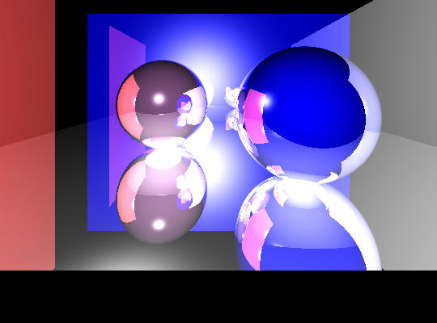

# HizTracer

*A Web-Based Ray Tracing Image Generator*


HizTracer is a Python-based ray tracing application with a web interface that allows users to generate custom 3D ray-traced images. Through its interactive website, users can design their own scenes by placing objects such as spheres and walls, adjusting materials, and configuring light sources. The goal of this project is to combine a mathematically driven ray tracing engine with a user-friendly web experience.

---

## Features

* Web-based scene configuration
* Customizable spheres, walls, materials, and lights
* Recursive ray tracing with reflections
* Real-time rendering progress feedback
* Server-side validation for secure input handling



---

## Design and Structure

### Ray Tracing Engine (`lib.py`)

At the core of HizTracer lies a ray tracing engine written entirely in Python. The engine is composed of several classes, each responsible for a specific part of the rendering pipeline.

One of the most fundamental classes is the **Vector** class. It provides basic vector arithmetic such as addition and scalar multiplication, along with more advanced operations like dot product and cross product. These operations are essential for calculating lighting, surface normals, and reflections in 3D space.

The **Window** class defines the screen space and how pixels map to 3D coordinates. It takes the screen width and height as input and computes the aspect ratio, which is crucial for avoiding image distortion. In HizTracer, the x-axis of the screen spans from -1 on the left to +1 on the right. The y-axis is derived from the aspect ratio, where the upper boundary is `-aspect_ratio` and the lower boundary is `+aspect_ratio`. Using these values, the class calculates constant step sizes (`x_step` and `y_step`) that determine how each pixel corresponds to a point in 3D space. These computed values are stored as attributes for later use during rendering.

In addition to screen geometry, the Window class also handles image creation and access. It takes a filename and a background color as arguments and either creates a new PNG image or loads an existing one from the `./static` directory using the `os` module and the Pillow library. The background color is applied to initialize the image before rendering begins.

Object appearance is controlled through the **Material** class. This class allows users to define reflectivity (a value between 0 and 1) and a shininess coefficient for specular highlights. These parameters directly affect how light interacts with objects in the scene.

All renderable objects inherit from the abstract **Shape** class, which stores common attributes such as color and material. Two concrete implementations of Shape are provided: **Sphere** and **Wall**.

The **Wall** class is defined by its four corner points, each represented as a Vector. From these points, two edge vectors are constructed and their cross product is used to compute the wall’s surface normal. Both the corner points and the normal vector are stored as attributes for use during intersection testing and shading.

The **Sphere** class is defined by a center point and a radius, both of which are stored as attributes. Ray–sphere intersections are calculated analytically using the sphere equation.

The **Ray** class represents a ray of light and consists of an origin and a direction vector. The direction vector is normalized upon creation. Ray objects are used extensively to trace both primary rays (from the camera) and reflected rays.

Lighting is handled by the **Light** class, which stores the light source’s position and color as vectors.

All shapes and lights are collected into lists and passed to the **Scene** class along with the Window instance, camera position, and a maximum recursion depth. The recursion depth determines how many times a ray is allowed to bounce, directly affecting realism and performance.

Rendering is performed by the `screen_blit()` method of the Scene class. This method iterates over every pixel in the image using Pillow’s indexing system. For each pixel, a ray is cast from the camera through the corresponding 3D screen coordinate. The color of each pixel is computed using the recursive `ray_bounce()` method.

The `ray_bounce()` method determines the closest object hit by the ray, computes diffuse and specular shading, and generates a reflected ray if the material is reflective. This process continues recursively until the maximum depth is reached, producing more realistic lighting effects.

To determine which object is hit first, the `closest_object()` method is used. For spheres, this is done by substituting the ray equation into the sphere equation and solving for the parameter *t*, which represents the distance along the ray. For walls, the ray is tested against the plane defined by the wall’s normal, followed by a bounds check to ensure the hit point lies within the wall’s corners.

---

## Web Interface (`index.html`, `app.py`)

The web interface allows users to interactively define all required scene parameters. The main page includes an **About** section explaining HizTracer, a **Scene** section containing the input form, and a **Render** section that displays the generated image along with a progress bar.

When users visit the website, a default scene is preloaded and can be rendered immediately. Users may also define their own scenes by following the input formats shown in the form placeholders.

Upon submission, the form data is sent to `app.py` using a POST request. Although client-side validation is performed in `index.html`, server-side validation is also implemented to protect against malformed or malicious input. If validation fails, informative error messages are returned to the user.

Once valid input is received, a separate rendering thread is started. This allows the rendering process to update a progress attribute, which is periodically queried by the frontend using JavaScript’s `setInterval()` function. As a result, users can see both rendering progress and the partially updated image in real time. After rendering is complete, users can submit a new scene without reloading the page.


---

## Setup

First, clone the repository:

```bash
git clone git@github.com:IndaPlus25/aeozbek-raytracer.git
```

Navigate into the project directory:

```bash
cd aeozbek-raytracer
```

Ensure all dependencies listed in `requirements.txt` are installed, then run:

```bash
python3 app.py
```

The application will start at:

```
http://127.0.0.1:5000
```

You can open this address in your browser to start using HizTracer.


---

## Usage

HizTracer provides a default scene that can be rendered immediately. Users may also create custom scenes by entering values that follow the provided formats. After submitting valid input and clicking **Render Scene**, the ray-traced image is generated shortly thereafter.

It is important to note that the visible screen space is defined as follows:

* The x-axis ranges from -1 (left) to +1 (right)
* The y-axis ranges from `-screen_height / screen_width` (top) to `+screen_height / screen_width` (bottom)

Only objects positioned within these bounds will appear in the rendered image, as this configuration implicitly defines the field of view.

---

## Potential Further Improvements

* Replace global variables in `app.py` with a proper task queue system
* Introduce multi-core rendering to reduce render times for complex scenes
* Add texture mapping support for more detailed surfaces
* Implement a login system to allow users to view previously generated images
